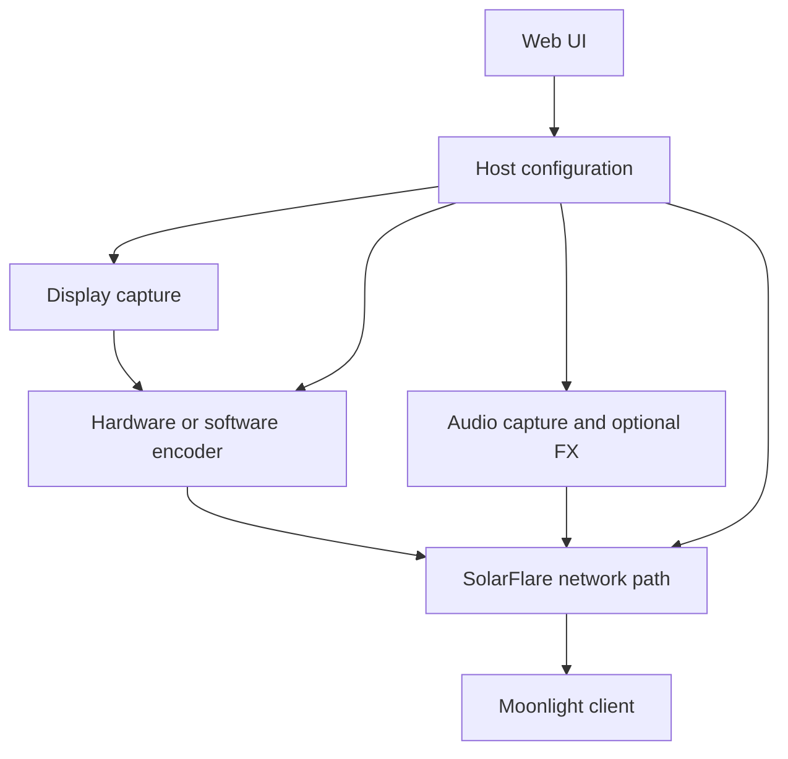

<div align="center">
  
  <h1>SolarFlare</h1>
  <p><strong>A game-streaming host for Moonlight.</strong></p>
  <p>A Linux game-streaming host for Moonlight, built for local networks.</p>

  <p>
    <a href="https://github.com/vindeckyy/Solar-Flare/releases/latest"></a>
    <a href="LICENSE"></a>
    <a href="https://moonlight-stream.org/"></a>
    
  </p>

  <p>
    <a href="https://vindeckyy.github.io/Solar-Flare/">Website</a> |
    <a href="#install">Install</a> |
    <a href="#first-run-and-pairing">Pairing</a> |
    <a href="#web-interface">Interface</a> |
    <a href="#network-ports-and-firewall">Ports</a> |
    <a href="#performance-architecture">Architecture</a> |
    <a href="#configuration">Configuration</a> |
    <a href="#build-and-test">Build</a> |
    <a href="docs/CHANGELOG-SolarFlare.md">Changelog</a>
  </p>
</div>


---

## Overview

SolarFlare is a self-hosted game-streaming server for Moonlight clients. It
combines low-latency Linux capture and transport with a Web UI for pairing
devices, managing applications, changing host settings, and checking logs.

| | |
|---|---|
| **Primary use** | High-quality game and desktop streaming across a trusted local network |
| **Host focus** | Linux x86-64, with build and runtime tuning for modern AMD and Intel CPUs |
| **Client protocol** | Moonlight / NVIDIA GameStream-compatible transport |
| **Control plane** | Responsive HTTPS interface at `https://localhost:47990` |
| **Current release** | [`v1.3.0`](https://github.com/vindeckyy/Solar-Flare/releases/latest) |
| **Build tag** | [`v2026.909.1-solarflare`](https://github.com/vindeckyy/Solar-Flare/releases/tag/v2026.909.1-solarflare) |

> [!IMPORTANT]
> SolarFlare preserves the executable name, service identifier, ports, state
> format, and configuration directory used by Sunshine so existing Moonlight
> pairings remain compatible. User-facing product identity is SolarFlare;
> compatibility identifiers such as `sunshine`, `SUNSHINE_CLIENT_*`, and
> `~/.config/sunshine` intentionally remain unchanged.

### SolarFlare vs upstream Sunshine

| Topic | SolarFlare | Upstream Sunshine |
|---|---|---|
| **Maintained install path (Linux)** | `./scripts/linux-install.sh` | Distro packages, AppImage, Flatpak, Docker |
| **Release artifacts** | `sunshine-x86_64`, `solarflare-linux-x86_64.tar.gz` | Platform installers per OS |
| **Web UI** | SolarFlare redesign with PWA, telemetry, fork controls | Upstream Sunshine UI |
| **Fork tunables** | Network pacing, CPU pinning, audio FX, headless capture, webhooks | Not present |
| **Config / state paths** | `~/.config/sunshine/` (unchanged) | Same |
| **Service unit** | `app-dev.lizardbyte.app.Sunshine.service` | Same |

When this README or linked docs mention "Sunshine" in a compatibility context
(executable name, config keys, Moonlight pairing), that refers to the shared
protocol surface - not the upstream LizardByte distribution.

## Fork additions

| System | SolarFlare approach |
|---|---|
| **Host control** | A responsive Web UI with command search, host status, troubleshooting tools, live host-resource telemetry charts, and PWA install support |
| **Network path** | Link-aware pacing, optional busy polling, expanded ENet buffers, DSCP tagging, and adaptive bitrate controls |
| **Scheduling** | Capture-thread affinity, controlled real-time scheduling, native CPU tuning, and optional boot-time performance services |
| **Video** | NVENC tuning profiles, per-application encoder overrides, headless display paths, and hardware-aware capture selection |
| **Audio** | Low-latency PipeWire hints plus optional AGC, voice activity detection, ducking, noise gating, and Opus controls |
| **Operations** | Scoped API tokens, trusted-subnet pairing, per-client streaming profiles, stream lifecycle webhooks, session history, idle auto-stop, and structured logs |

SolarFlare exposes these as individual controls. Defaults stay compatible with
upstream, and each tuning path can be disabled when comparing hosts.

## Web interface

The Web UI covers routine host setup and troubleshooting. Animation is limited
to interactions and state changes.

<table>
  <tr>
    <td width="50%"><strong>Pair a client</strong><br><sub>Focused PIN entry with clear host state.</sub><br><br></td>
    <td width="50%"><strong>Manage applications</strong><br><sub>Launch definitions, artwork, and import tools.</sub><br><br></td>
  </tr>
  <tr>
    <td width="50%"><strong>Discover clients</strong><br><sub>A local Moonlight client catalog with no third-party runtime fetch.</sub><br><br></td>
    <td width="50%"><strong>Tune the host</strong><br><sub>Search or browse settings by category.</sub><br><br></td>
  </tr>
  <tr>
    <td width="50%"><strong>Inspect the pipeline</strong><br><sub>Logs, diagnostics, and recovery actions in one place.</sub><br><br></td>
    <td width="50%"><strong>Monitor the host</strong><br><sub>Connection state, release status, and direct actions.</sub><br><br></td>
  </tr>
</table>

## Performance architecture



The fork-specific path sits in four areas:

1. **Capture:** X11, KMS, PipeWire/portal, headless compositor, and optional
   Hermes-KMS paths are selected according to the build and host environment.
2. **Encode:** NVENC presets and per-application overrides tune latency,
   lookahead, adaptive quantization, and frame structure without changing the
   Moonlight protocol.
3. **Transport:** Link-speed detection, pacing, socket buffers, busy polling,
   QoS marking, and adaptive bitrate respond to local-network conditions.
4. **Control:** The HTTPS UI, API scopes, pairing rules, and diagnostics expose
   host state. No cloud services sit in the streaming path.

See [SolarFlare configuration](docs/CONFIGURATION.md) for fork controls and the
[complete configuration reference](docs/configuration.md) for inherited host
options.

## Install

### Supported release profile

SolarFlare v1.3.0 publishes three Linux x86-64 files:

| Asset | Purpose |
|---|---|
| `sunshine-x86_64` | Stripped executable for updating an existing SolarFlare install |
| `solarflare-linux-x86_64.tar.gz` | Executable plus matching runtime and Web UI assets for existing installs |
| `SHA256SUMS` | SHA-256 checksums for both downloads |

> [!CAUTION]
> New users should always build fresh with `./scripts/linux-install.sh`. The
> release binaries are only for people updating an already working SolarFlare
> install. Prefer **Update now** in the Web UI when that path is available.
>
> Build from source for Web UI changes, desktop files and icons, shaders, udev
> rules, the systemd user service unit, and installer helpers such as
> `solarflare-update-apply`. The bare `sunshine-x86_64` file is the executable
> only.

The `sunshine-x86_64` compatibility filename is intentional. SolarFlare keeps
the executable and service names expected by existing Sunshine installations
and Moonlight pairings.

The source tree retains inherited cross-platform code, but the SolarFlare
release and performance profile documented here are maintained for Linux.

### Fresh source installation

```bash
git clone --recursive https://github.com/vindeckyy/Solar-Flare.git
cd Solar-Flare
./scripts/linux-install.sh
systemctl --user enable --now app-dev.lizardbyte.app.Sunshine.service
```

The installer detects Arch/CachyOS, Debian/Ubuntu, Fedora-family, openSUSE,
Bazzite, and NixOS hosts. On NixOS it enters the repository's reproducible
Nix shell and installs into `~/.local`. Read the
[porting guide](docs/PORTING.md) for the required declarative host settings
or before using an unsupported distribution.

| Distribution family | Package manager used by installer | Notes |
|---|---|---|
| Arch, CachyOS, Manjaro, EndeavourOS | `pacman` | Primary development target |
| Debian, Ubuntu, Mint, Pop!, Kali | `apt` | Requires GCC 13+; see [Porting](docs/PORTING.md) |
| Fedora, Nobara, Rocky, Alma | `dnf` | `rpm-fusion` may be required for FFmpeg headers |
| openSUSE Tumbleweed / Leap | `zypper` | Package names use underscores in some cases |
| Bazzite / rpm-ostree | `rpm-ostree` | **Reboot required** after dependency layering |
| NixOS | `nix-shell` | User-local install; declarative host config required |

`scripts/linux-install.sh` is the maintained SolarFlare path.
`scripts/linux_build.sh` is the inherited upstream Docker/CI builder and is
not required for normal installs. `scripts/cachyos-build.sh` remains as a
compatibility wrapper that forwards to `linux-install.sh`.

#### Installer flags

| Flag | Effect |
|---|---|
| *(none)* | Full install: deps, submodules, cmake, build, install, post-install services |
| `--clean` | Remove `cmake-build-cachyos` before configuring |
| `--skip-deps` | Skip package installation; rebuild only |
| `--print-distro-id` | Print detected distro ID and exit |

#### What the installer places on disk

| Path | Purpose |
|---|---|
| `/usr/local/bin/sunshine` | Host executable (or `~/.local/bin/sunshine` on NixOS) |
| `~/.config/sunshine/sunshine.conf` | Created on first run if missing |
| `~/.config/sunshine/apps.json` | Application catalog |
| `~/.config/systemd/user/app-dev.lizardbyte.app.Sunshine.service` | User service unit |
| `/usr/local/libexec/solarflare-update-apply` | Privileged Web UI update helper |
| `/etc/systemd/system/*` (optional) | Fork redesign performance services |

Capabilities `cap_sys_admin` and `cap_sys_nice` are applied to the installed
binary so capture, scheduling, and buffer tuning work without running as root.

### Update an existing installation

Use **Update now** on the outdated Web UI banner. Open the chevron to watch
the command log. That path downloads `solarflare-linux-x86_64.tar.gz`, checks
`SHA256SUMS`, installs the binary and assets, then restarts. An active stream
blocks apply until the session ends.

If the install lives under `/usr/local`, you need the
`solarflare-update-apply` helper from `./scripts/linux-install.sh` or
`cmake --install`.

Manual binary-only fallback:

```bash
systemctl --user stop app-dev.lizardbyte.app.Sunshine.service
sudo curl --fail --location \
  --output /usr/local/bin/sunshine \
  https://github.com/vindeckyy/Solar-Flare/releases/latest/download/sunshine-x86_64
sudo chmod 0755 /usr/local/bin/sunshine
sudo setcap 'cap_sys_admin,cap_sys_nice+p' /usr/local/bin/sunshine
systemctl --user start app-dev.lizardbyte.app.Sunshine.service
```

### Verify the host

```bash
systemctl --user --no-pager status app-dev.lizardbyte.app.Sunshine.service
getcap /usr/local/bin/sunshine
journalctl --user -u app-dev.lizardbyte.app.Sunshine.service -n 50 --no-pager
curl --insecure --output /dev/null --write-out '%{http_code}\n' \
  https://localhost:47990/
sunshine --version 2>&1 | grep -m1 'Fork: SolarFlare'
```

| Check | Expected result |
|---|---|
| Service status | `active (running)` |
| `getcap` | `cap_sys_admin,cap_sys_nice=p` on the binary |
| `curl` (before login) | HTTP `401` (UI is serving, auth required) |
| `--version` | Line containing `Fork: SolarFlare` |

An unauthenticated `curl` request should return `401`; the browser login page
becomes available after credentials are configured.

## First run and pairing

After install, complete these steps once before streaming from Moonlight.

1. **Start the service** (if not already running):
   ```bash
   systemctl --user enable --now app-dev.lizardbyte.app.Sunshine.service
   ```
2. **Open the Web UI** at `https://localhost:47990` (or `https://<host-lan-ip>:47990`).
   Accept the self-signed certificate warning - SolarFlare uses a locally generated TLS cert.
3. **Create credentials** on first launch. Store them securely; reset with
   `sunshine --creds <user> <pass>` if forgotten ([troubleshooting](docs/troubleshooting.md)).
4. **Add applications** under **Applications**, or run the built-in game scanner.
5. **Pair Moonlight:**
   - On the client, add the host by IP or mDNS hostname.
   - When Moonlight shows a PIN, open **PIN** in the Web UI, enter the PIN and a device name, then confirm.
   - Select an application in Moonlight to start the stream.

> [!TIP]
> If the host does not appear automatically, add it manually in Moonlight with
> the host's LAN IP address. mDNS discovery requires the client and host to be
> on the same broadcast domain without AP isolation.

> [!WARNING]
> Trusted-subnet auto-pairing (`trusted_subnets`, `trusted_subnet_auto_pairing`)
> skips the PIN for clients on listed CIDR ranges. Use only on networks you fully
> control. See [SolarFlare configuration](docs/CONFIGURATION.md#trusted-subnets-and-auto-pairing).

Step-by-step pairing flows, firewall rules, and client-specific notes live in
[Getting started - SolarFlare on Linux](docs/getting_started.md#solarflare-on-linux-first-run).

## Network ports and firewall

With the default `port = 47989` in `sunshine.conf`, SolarFlare binds the
GameStream-compatible port set below. Changing `port` shifts every derived
port by the same offset - see the [port setting](docs/configuration.md) in the
complete configuration reference.

| Service | Protocol | Default port | Required for |
|---|---|---|---|
| GameStream HTTP | TCP | 47989 | Client discovery, pairing, launch |
| GameStream HTTPS | TCP | 47984 | Secure GameStream API |
| Web UI | TCP | 47990 | Browser configuration (LAN by default) |
| RTSP setup | TCP | 48010 | Stream negotiation |
| Video | UDP | 47998 | Encoded video (primary stream) |
| Audio | UDP | 47999 | Opus audio |
| Control | UDP | 48000 | Input and control channel |
| Additional UDP | UDP | 48002 | Auxiliary stream traffic |
| RTSP (UDP) | UDP | 48010 | RTSP when used over UDP |

> [!NOTE]
> Moonlight connectivity tests reference these well-known port numbers. If you
> change the base `port`, open the corresponding shifted ports on your firewall
> and router.

**LAN streaming:** Allow the TCP and UDP ports above between the Moonlight
client subnet and the host. **Internet streaming:** Enable UPnP in the Web UI
or forward the same ports manually on your router.

Distro-specific firewall examples (`ufw`, `firewalld`, `nftables`, NixOS) are
documented in [Getting started](docs/getting_started.md#firewall-rules-by-distribution).

## Moonlight client compatibility

SolarFlare speaks the Moonlight / GameStream host protocol. Any client built on
[moonlight-common-c](https://github.com/moonlight-stream/moonlight-common-c)
or the official Moonlight apps should pair and stream against a correctly
configured SolarFlare host.

| Client | Platforms | SolarFlare notes |
|---|---|---|
| [Moonlight Desktop](https://github.com/moonlight-stream/moonlight-qt) | Windows, macOS, Linux | Recommended desktop client; full codec and HDR feature set |
| [Moonlight Android](https://github.com/moonlight-stream/moonlight-android) | Android, Android TV | Use manual host add if mDNS is blocked |
| [Moonlight iOS / tvOS](https://github.com/moonlight-stream/moonlight-ios) | iPhone, iPad, Apple TV | Same pairing flow; HDR depends on client and host encode path |
| [Moonlight Web](https://moonlight-stream.org/) | Chrome, Edge | Browser client; lower feature surface than native apps |
| [Moonlight Embedded](https://github.com/moonlight-stream/moonlight-embedded) | Raspberry Pi, embedded Linux | Host must be a separate machine; runs client only |
| Third-party forks | Various | Compatibility varies; unsupported by SolarFlare |

**Codec support** depends on host hardware (NVENC, VAAPI, software) and client
capabilities. H.264 is universally supported; HEVC and AV1 require encoder and
client support on both ends. Per-client overrides are available via
`client_profile_*` keys - see [SolarFlare configuration](docs/CONFIGURATION.md#per-client-streaming-profiles).

## Headless hosts and multi-GPU systems

### Headless (no monitor attached)

SolarFlare can stream from machines without a physical display:

1. Enable `headless_virtual_display = true` and optional
   `headless_width` / `headless_height` / `headless_refresh` in
   `sunshine.conf` - see [headless capture](docs/CONFIGURATION.md#headless_virtual_display).
2. For NVIDIA hosts, an HDMI/DP dummy plug or EDID emulator is still often
   required for stable modes and NVENC initialization.
3. KMS capture (HDR, lowest latency on AMD/Intel) needs an active DRM output;
   virtual outputs and Hermes-KMS are covered in [Getting started](docs/getting_started.md#headless-and-virtual-display-setup).

### Multi-GPU and hybrid graphics

| Scenario | Guidance |
|---|---|
| **Laptop hybrid (iGPU + dGPU)** | Run games on the GPU that owns the display being captured. PRIME offload alone may capture the wrong framebuffer. |
| **External GPU (eGPU)** | Connect a display or dummy plug to the eGPU; run the game on that output. |
| **Multi-GPU workstation** | Select the capture adapter in the Web UI or `adapter_name` / `output_name` settings. |
| **NVIDIA primary** | Ensure the user session loads the discrete driver (`nvidia` module, not `nouveau`). |

SolarFlare's `gpu_governor` fork key raises AMD cards to `performance` during
capture. NVIDIA clock locking is available via optional
[redesign services](packaging/linux/redesign/README.md).

## Configuration

Configuration remains at `~/.config/sunshine/sunshine.conf`, with application
definitions in `~/.config/sunshine/apps.json`.

| Area | Representative controls | Documentation |
|---|---|---|
| Network | `busy_poll_us`, `rate_cap_pct`, `enet_4mib_buffer`, `dscp_qos` | [Fork controls](docs/CONFIGURATION.md#the-tunables-at-a-glance) |
| Scheduling | `cpu_pinning`, `gpu_governor` | [Scheduling behavior](docs/CONFIGURATION.md#cpu_pinning) |
| Capture | `headless_virtual_display`, `headless_width`, `headless_height`, `headless_refresh` | [Capture controls](docs/CONFIGURATION.md#headless_virtual_display) |
| Latency | `latency_mode` (`safe` / `aggressive`) | [Latency mode](docs/CONFIGURATION.md#latency_mode) |
| Session | `idle_timeout_min`, per-client profiles (`client_profile_*`), webhooks (`webhook_url_*`, `webhook_secret`) | [Webhooks](docs/CONFIGURATION.md#webhooks) / [Profiles](docs/CONFIGURATION.md#per-client-streaming-profiles) |
| Video | `nvenc_tuning_preset`, adaptive bitrate, codec and quality controls | [Complete reference](docs/configuration.md) |
| Audio | `pipewire_latency_ms`, `sf_audio_*`, `sf_opus_*` | [Audio FX](docs/CONFIGURATION.md#audio-fx-pre-encoder-processing) |
| Access | Scoped API tokens, trusted subnets, pairing, origin policy | [API](docs/api.md) / [Security](SECURITY.md) |

For a minimal per-application encoder override:

```json
{
  "name": "Competitive profile",
  "cmd": "steam steam://rungameid/730",
  "encoder-preset": 0
}
```

Preset values are `-1` for the host default, `0` for latency, `1` for
balanced, and `2` for quality.

## Build and test

The project uses CMake, Ninja, Vite, and GoogleTest. Keep build directories
under the `cmake-build-` prefix.

```bash
git submodule update --init --recursive

cmake -S . -B cmake-build-release -G Ninja \
  -DCMAKE_BUILD_TYPE=Release \
  -DBUILD_DOCS=OFF \
  -DBUILD_TESTS=OFF
cmake --build cmake-build-release --target sunshine web-ui -j2
```

To run the test suite:

```bash
cmake -S . -B cmake-build-tests -G Ninja \
  -DCMAKE_BUILD_TYPE=Debug \
  -DBUILD_TESTS=ON \
  -DBUILD_DOCS=OFF
cmake --build cmake-build-tests --target test_sunshine -j2
./cmake-build-tests/tests/test_sunshine --gtest_brief=1
```

Platform-specific dependencies and compiler requirements are documented in
[Building](docs/building.md) and [Porting SolarFlare](docs/PORTING.md).

## Repository map

| Path | Purpose |
|---|---|
| `src/` | Streaming host, transport, capture, encode, audio, and configuration |
| `src_assets/common/assets/web/` | SolarFlare Web UI |
| `tests/` | Unit, integration, regression, and documentation contracts |
| `packaging/` | Platform packaging and optional Linux performance services |
| `scripts/` | Linux installer, release, screenshot, and maintenance tooling |
| `docs/` | User, operator, developer, and inherited configuration references |

## Documentation

| Document | Use it for |
|---|---|
| [Getting started](docs/getting_started.md) | SolarFlare Linux setup, pairing, firewall, ports; inherited platform reference |
| [Guides](docs/guides.md) | Curated how-tos: headless, LAN tuning, multi-GPU, migration workflows |
| [GameStream migration](docs/gamestream_migration.md) | Moving from NVIDIA GameStream or Moonlight Internet Hosting Tool |
| [SolarFlare configuration](docs/CONFIGURATION.md) | Fork-specific network, scheduling, audio, and capture controls |
| [Complete configuration](docs/configuration.md) | Every inherited host option |
| [Porting](docs/PORTING.md) | Distribution packages, toolchains, and manual builds |
| [Troubleshooting](docs/troubleshooting.md) | Capture, encoder, audio, networking, and input diagnostics |
| [API](docs/api.md) | Automation and scoped host access |
| [Security](SECURITY.md) | Supported versions and private vulnerability reporting |
| [SolarFlare changelog](docs/CHANGELOG-SolarFlare.md) | Fork release and implementation history |

## Project policy

- **Security:** report SolarFlare-specific vulnerabilities privately through
  [GitHub Security Advisories](https://github.com/vindeckyy/Solar-Flare/security/advisories/new).
- **Contributions:** read [CONTRIBUTING.md](CONTRIBUTING.md) and the
  [development guide](docs/contributing.md) before opening changes.
- **License:** SolarFlare is distributed under
  [GPL-3.0-only](LICENSE).
- **Upstream:** the GameStream foundation and inherited platform work come
  from [LizardByte/Sunshine](https://github.com/LizardByte/Sunshine). Internal
  compatibility names are retained where changing them would break clients,
  configuration, packaging, or update paths.
- **Acknowledgment:** SolarFlare's Linux capture, compositor, and stream-health
  design was informed by reviewing [papi-ux/polaris](https://github.com/papi-ux/polaris).
  Thanks to its contributors. SolarFlare remains a Sunshine-derived project;
  that review was design inspiration, not incorporated source.

---

<div align="center">
  <strong>SolarFlare</strong><br>
  <sub>Self-hosted streaming on your LAN. No cloud in the path.</sub>
</div>
