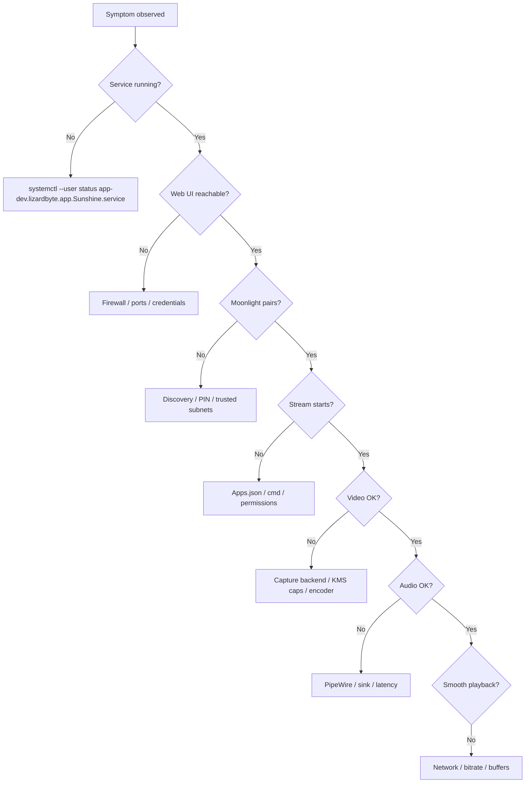

# Troubleshooting

This guide walks through the most common SolarFlare failure modes on Linux
(the primary release target) and inherited platforms. Use the **symptom index**
to jump directly to a fix, or follow the **structured diagnostic flow** when
the cause is unclear.

> [!TIP]
> The Web UI **Troubleshooting** page exposes live host state, log tail,
> capability checks, and one-click recovery actions. Open `https://<host>:47990`
> after authenticating.

## Symptom index

| Symptom | Section |
|---|---|
| Cannot open Web UI / 401 loop | [Web UI access](#web-ui-access), [Forgotten credentials](#forgotten-credentials) |
| Moonlight cannot find host | [Discovery & firewall](#discovery-firewall-and-ports) |
| Pairing PIN fails or loops | [Pairing problems](#pairing-problems) |
| Black screen in stream | [KMS on Nvidia](#kms-streaming-fails-on-nvidia-gpus), [Capture backend](#capture-backend-selection) |
| No audio | [Audio routing](#audio-routing-linux) |
| Stutter / packet loss | [Network performance test](#network-performance-test), [Packet loss](#packet-loss-from-buffer-overruns) |
| High encode latency | [AMD encoding](#amd-encoding-latency-issues), [Performance tuning](performance_tuning.md) |
| Input not reaching game | [Input not working](#input-not-working), [Controller in Steam](#controller-works-in-steam-but-not-in-games) |
| Game won't launch from app | [Application launch failures](#application-launch-failures) |
| Update failed | [Host update failures](#host-update-failures) |
| Encoder errors in logs | [Hardware encoding fails](#hardware-encoding-fails) |

---

## Structured diagnostic flow

Work top-down. Stop when the symptom resolves.



### Step 1 - Verify the service

```bash
systemctl --user --no-pager status app-dev.lizardbyte.app.Sunshine.service
journalctl --user -u app-dev.lizardbyte.app.Sunshine.service -n 100 --no-pager
```

Expected: `active (running)`. If failed, read the last 20 log lines for missing
libraries, port bind failures, or config parse errors.

### Step 2 - Verify capabilities (Linux KMS)

```bash
getcap "$(command -v sunshine)"
```

Expected after `./scripts/linux-install.sh` or manual update:

```text
/usr/local/bin/sunshine cap_sys_admin,cap_sys_nice=p
```

Without `cap_sys_admin`, KMS capture fails. Re-apply:

```bash
sudo setcap 'cap_sys_admin,cap_sys_nice+p' /usr/local/bin/sunshine
```

### Step 3 - Verify Web UI

```bash
curl --insecure -o /dev/null -w '%{http_code}\n' https://localhost:47990/
```

Unauthenticated requests should return `401` (service is listening). `000` or
connection refused indicates firewall or service not bound.

### Step 4 - Verify discovery and streaming ports

See [Discovery, firewall, and ports](#discovery-firewall-and-ports).

### Step 5 - Test network path

Run [iPerf3](#network-performance-test) at your target Moonlight bitrate before
encoder or capture changes.

---

## Discovery, firewall, and ports

SolarFlare uses fixed ports compatible with Moonlight / GameStream expectations.

| Port | Protocol | Purpose |
|---|---|---|
| 47984–47990 | TCP | Control, RTSP, Web UI (47990 HTTPS) |
| 48010 | TCP | Additional control (version-dependent) |
| 47998–48000 | UDP | Video/audio stream (primary video often 47998) |
| 48010 | UDP | Some control paths |

### Firewall (firewalld example)

```bash
sudo firewall-cmd --permanent --add-port=47984-47990/tcp
sudo firewall-cmd --permanent --add-port=48010/tcp
sudo firewall-cmd --permanent --add-port=47998-48000/udp
sudo firewall-cmd --reload
```

### Firewall (ufw example)

```bash
sudo ufw allow 47984:47990/tcp
sudo ufw allow 48010/tcp
sudo ufw allow 47998:48000/udp
```

### LAN discovery

Moonlight discovers hosts via mDNS (`_nvstream._tcp`). If discovery fails but
manual IP connection works, check:

- Host and client on same broadcast domain (VLAN isolation blocks mDNS)
- `avahi-daemon` / `systemd-resolved` running on host
- Multicast blocked by AP "client isolation"

Add the host manually in Moonlight with `https://<host-ip>:47990` as needed.

---

## Pairing problems

### PIN rejected or not shown

1. Confirm host clock is synchronized (`timedatectl status`)
2. Open Web UI → PIN screen; enter PIN within timeout
3. Check `trusted_subnets` / `trusted_subnet_auto_pairing` in
   [CONFIGURATION.md](CONFIGURATION.md) - overly broad subnets can pair
   unexpected clients; misconfigured CIDR blocks can block legitimate LAN clients

### Existing Sunshine pairings after fork migration

SolarFlare preserves `~/.config/sunshine` state and certificate layout. If a
client still references an old host certificate, unpair on **both** sides and
re-pair. See [GameStream migration](gamestream_migration.md).

---

## Capture backend selection

Set `capture` in `sunshine.conf` or the Web UI Capture tab.

| Backend | Symptom when wrong | Fix |
|---|---|---|
| `kms` | Black screen, permission errors | setcap, `nvidia_drm.modeset=1`, try portal |
| `nvfbc` | Fails on Wayland / missing CUDA | Use KMS or portal on modern Linux |
| `x11` | Works but high latency | Prefer KMS when available |
| `portal` | Wrong monitor / mouse offset | `skip_wayland_correlation`, compositor settings |

Logs show the active capture module at stream start. Cross-reference
[Performance tuning - Capture backend](performance_tuning.md#capture-backend-selection).

---

## Audio routing (Linux)

### No audio in stream

1. Confirm default sink plays locally (`pw-play` / `speaker-test`)
2. Check SolarFlare logs for PipeWire connection errors
3. Lower `pipewire_latency_ms` only **after** crackling is ruled out - start at 8 ms
4. Ensure the game/application audio goes to the sink SolarFlare captures

### Crackling or desync

- Raise `pipewire_latency_ms` to 12–16 ms
- Disable heavy `sf_audio_*` FX one at a time
- Close browser tabs using PipeWire screen share on same sink

### Wrong device captured

Set explicit audio sink in Web UI or `audio_sink` in `sunshine.conf`.
List sinks: `pactl list sinks short` or `wpctl status`.

---

## Application launch failures

### Command exits immediately

- Test `cmd` from the same user/session as the systemd service
- Games requiring a display may need `headless_virtual_display = true` or a
  physical monitor attached
- Steam `steam://` URLs need Steam running or `steam -silent` in `prep-cmd`

### Permission denied on game files

The service runs as your user (user systemd unit). If files are root-owned or
on NTFS mounts with `noexec`, fix permissions or mount options.

### Anti-cheat / kernel modules

Some titles block virtual input or capture. This is a game policy limitation,
not a SolarFlare bug. Try portal capture or official remote-play solutions.

See [Application examples](app_examples.md) for working `apps.json` patterns.

---

## Host update failures

SolarFlare supports in-UI updates when installed via `./scripts/linux-install.sh`.

| Failure | Cause | Fix |
|---|---|---|
| Update button greyed | Active stream | Stop stream, retry |
| Checksum mismatch | Download corruption | Manual download from releases; verify `SHA256SUMS` |
| Permission denied on `/usr/local` | Missing helper | Install `solarflare-update-apply` from source build |
| Service won't restart | Port still bound | `journalctl --user -u ...`; kill stale sunshine |

Manual binary update procedure: [README - Update](../README.md#update-an-existing-installation).

---

## General

### Forgotten credentials

Reset the Web UI username and password:

```bash
sunshine --creds {new-username} {new-password}
```

> [!NOTE]
> AppImage and Flatpak packages are upstream Sunshine packaging, not SolarFlare
> releases. If you are running those, use their package-specific `--creds`
> commands from the upstream Sunshine docs instead.

> [!TIP]
> Replace `{new-username}` and `{new-password}` with the new credentials. Do not include the curly braces.

### Unusual mouse behavior

Attach a physical mouse to the SolarFlare host. Some systems do not report a usable pointer unless a mouse is connected.

### Web UI access

Check that the host firewall allows the Web UI port.

### Controller works in Steam but not in games

In Steam's controller settings, disable Xbox and PlayStation controller support
and leave Generic Gamepad support enabled.

Games may also select a physical controller before SolarFlare's virtual
controller. Disconnect or disable unused host controllers and try again. On
Linux, find the USB device under `/sys/bus/usb/devices/` and write `0` to its
`authorized` file.

### Network performance test

Game streaming needs a stable path between the host and client. Low latency,
low jitter, and little packet loss matter more than unused bandwidth.

Test the path with [iPerf3](https://iperf.fr).

Start `iperf3` in server mode on the SolarFlare host:

```bash
iperf3 -s
```

Run a 60-second reverse UDP test from the client at the bitrate you plan to stream, such as 50 Mbps:

```bash
iperf3 -c {HostIpAddress} -t 60 -u -R -b 50M
```

Check the client output for packet loss and jitter. Aim for less than 5% packet loss and less than 1 ms of jitter.

Android clients can use
[PingMaster](https://play.google.com/store/apps/details?id=com.appplanex.pingmasternetworktools).
iOS clients can use
[HE.NET Network Tools](https://apps.apple.com/us/app/he-net-network-tools/id858241710).

Testing across the internet requires forwarding TCP and UDP port 5201 to the host.

### Structured JSON logging

Set `SUNSHINE_LOG_JSON=1` to emit JSON lines instead of human-readable log lines. Each line is `{"ts":"...","level":"...","msg":"..."}` with escaped `msg` via `logging::json_escape` (handles `"`, `\`, `\n`, `\r`, `\t`). Any value other than `1` or unset restores human format. Verify with `SUNSHINE_LOG_JSON=1 ./sunshine 2>&1 | head -1 | python3 -m json.tool`. Helper `logging::is_json_logging_enabled()` reflects the env. See `src/logging.h` and `src/logging.cpp` `formatter`. Unit tests in `tests/unit/test_logging_json.cpp` cover `json_escape` and env handling.

### Packet loss from buffer overruns

Packet loss can occur when the host link is faster than the slowest link to the
client. At 60 FPS, SolarFlare sends a burst about every 16 ms. A slower
downstream link must buffer each burst, and a full buffer drops packets.

Common examples include a 2.5 Gbit/s host feeding a 1 Gbit/s or Wi-Fi client,
and a 1 Gbit/s host feeding a 100 Mbit/s client.

You can reduce the host NIC speed to match the slower link. On Linux, traffic
shaping can limit only the SolarFlare stream:

```bash
# 1) Remove existing qdisc (pfifo_fast)
sudo tc qdisc del dev <NIC> root

# 2) Add HTB root qdisc with default class 1:1
sudo tc qdisc add dev <NIC> root handle 1: htb default 1

# 3) Create class 1:1 for full 10 Gbit/s (all other traffic)
sudo tc class add dev <NIC> parent 1: classid 1:1 htb \
    rate 10000mbit ceil 10000mbit burst 32k

# 4) Create class 1:10 for the SolarFlare stream at 1 Gbit/s
sudo tc class add dev <NIC> parent 1: classid 1:10 htb \
    rate 1000mbit ceil 1000mbit burst 32k

# 5) Filter UDP source port 47998 into class 1:10
sudo tc filter add dev <NIC> protocol ip parent 1: prio 1 \
    u32 match ip protocol 17 0xff \
    match ip sport 47998 0xffff flowid 1:10
```

These rules limit UDP source port 47998 to 1 Gbit/s and do not persist after a
reboot. Change the last command if your stream uses a different port.

SolarFlare includes the networking improvements added after Sunshine 0.23.1,
which may prevent this problem without NIC speed limits.

### Packet loss from MTU

A lower [MTU](https://en.wikipedia.org/wiki/Maximum_transmission_unit) may help
some clients. One LG TV showed 30-60% packet loss with host MTU values of 1500
and 1472, and no packet loss at 1428. The cause was not confirmed, so try this
only after ruling out other network problems.

## Linux

### Hardware encoding fails

Some Mesa packages disable hardware decoding and encoding because of patent restrictions.

```txt
Error: Could not open codec [h264_vaapi]: Function not implemented
```

If this error appears in the SolarFlare logs, you may need to compile *Mesa*.
Follow the official Mesa3D
[Compiling and Installing](https://docs.mesa3d.org/install.html) instructions.

> [!IMPORTANT]
> Pass the following option to the build system to enable the encoders.
> SolarFlare does not require the matching decoders.
> ```bash
> -Dvideo-codecs=h264enc,h265enc
> ```

> [!NOTE]
> Other build options are listed in the
> [meson options](https://gitlab.freedesktop.org/mesa/mesa/-/blob/main/meson_options.txt) file.

### Input not working

The installer reloads the `udev` rules. Restart the host if the reload failed.

If input still does not work, add your user to the `input` group:

```bash
sudo usermod -aG input $USER
```

#### Multiseat

A compositor may ignore injected input when concurrent Wayland sessions run on
separate logind seats, such as `seat0` and `seat1`, unless SolarFlare's virtual
devices are assigned to the correct seat.

Set the target seat with the `input_seat` config key (Web UI Input tab or
`sunshine.conf`):

```bash
input_seat = seat1
```

Precedence is `input_seat` > `XDG_SEAT` > empty/`seat0` (no isolation).
The target seat must exist and usually needs a display or input device
attached. Create and populate it before starting SolarFlare:

```bash
sudo loginctl seat-add seat1 /sys/bus/pci/devices/0000:00:02.0
```

When `input_seat` is set to a non-default seat, SolarFlare writes a transient
runtime udev rule to `/run/udev/rules.d/99-solarflare-seat.rules` and
synthesizes a `change` uevent for each virtual device. Runtime injection is the
primary path and updates automatically as devices are created.

If `/run/udev` is read-only or runtime injection is otherwise unavailable, copy
the shipped fallback rule and edit the seat literal:

```bash
sudo cp src_assets/linux/misc/99-solarflare-seat.rules /etc/udev/rules.d/99-solarflare-seat.rules
# Edit the ATTRS{name}=="* (seat1)" and ENV{ID_SEAT}="seat1" literal as needed
sudo udevadm control --reload-rules && sudo udevadm trigger -s input
```

SolarFlare also appends the seat name (for example ` (seat1)`) to each virtual
device name, so the rule matches:
- Keyboard passthrough (seat1)
- Mouse passthrough (seat1)
- Sunshine PS5 (virtual) pad (seat1)

### KMS streaming fails

KMS capture needs `cap_sys_admin` (SolarFlare installs
`cap_sys_admin,cap_sys_nice+p` via `./scripts/linux-install.sh` or after a
binary update). Upstream Flatpak and AppImage packages cannot grant those
privileges; SolarFlare does not publish those package formats. Prefer a
source install, or use XDG Portal Capture when KMS is unavailable.

### Windows flicker or disappear with KMS on KDE Plasma 6.5+

KWin overlays can interfere with KMS capture. Disable them with the
[`KWIN_USE_OVERLAYS`](https://invent.kde.org/plasma/kwin/-/wikis/Environment-Variables#kwin_use_overlays)
environment variable:

```bash
export KWIN_USE_OVERLAYS=0
```

> [!NOTE]
> Disabling overlays will reduce KWin's rendering efficiency. Consider using XDG Portal Capture instead.

### KMS streaming fails on Nvidia GPUs

If KMS capture produces a black stream, enable modesetting for the Nvidia
kernel module by placing this directive on the kernel command line:

```bash
nvidia_drm.modeset=1
```

Follow your distribution's instructions for changing the kernel command line.
GRUB is the most common bootloader for this setup.

### AMD encoding latency issues

High or unstable encoding latency in Moonlight's performance overlay can
indicate Mesa older than 24.2, especially at 4K.

Mesa 24.2 added a
[low-latency encoding mode](https://gitlab.freedesktop.org/mesa/mesa/-/merge_requests/30039),
enabled through the
[`AMD_DEBUG`](https://docs.mesa3d.org/envvars.html#envvar-AMD_DEBUG) environment
variable:

```bash
export AMD_DEBUG=lowlatencyenc
```
SolarFlare sets this variable automatically.

Use `amdgpu_top` to check VCLK and DCLK. Both clocks should remain high while
low-latency encoding is active; without it, they may fluctuate.

### Gamescope compatibility

Games running inside Gamescope may stutter while streaming.

## macOS

### Dynamic session lookup failed

This error means SolarFlare could not find the D-Bus session socket:

> Dynamic session lookup supported but failed: launchd did not provide a socket path, verify that
> org.freedesktop.dbus-session.plist is loaded!

Load the launch agent:

```bash
launchctl load -w /Library/LaunchAgents/org.freedesktop.dbus-session.plist
```

## Windows

### No gamepad detected

Virtual gamepads require ViGEmBus 1.17 or newer. Install it from the Web UI's
Troubleshooting page or download it from
[ViGEmBus releases](https://github.com/nefarius/ViGEmBus/releases/latest), then
restart Windows.

### Permission denied

SolarFlare runs as the `SYSTEM` account on Windows. A game or application on
another drive may fail to launch if that account cannot read its files.

Grant the `SYSTEM` principal read and execute access to the application's files
and directories. Grant write access only where the application needs it.

### Stuttering

For NVIDIA GPUs, disable `vsync:fast` in the NVIDIA Control Panel.

<div class="section_buttons">

| Previous      |                    Next |
|:--------------|------------------------:|
| [API](api.md) | [Building](building.md) |

</div>

<details style="display: none;">
  <summary></summary>
  [TOC]
</details>
